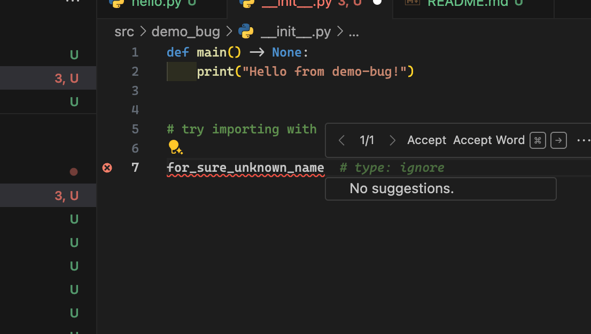

# Reproduction repo for bug in pylance-release

See https://github.com/microsoft/pylance-release/issues/7242

Execute `uv sync` to create venv.

Make sure:
- correct .venv selected in VScode (visible as soon as you open a python file) in the buttom right

Try to import `for_sure_unknown_name` from `__init__.py` directly by just typing it and then autocomplete with ctrl + space:

